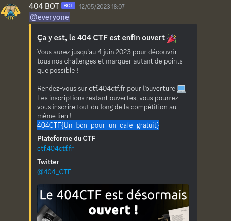
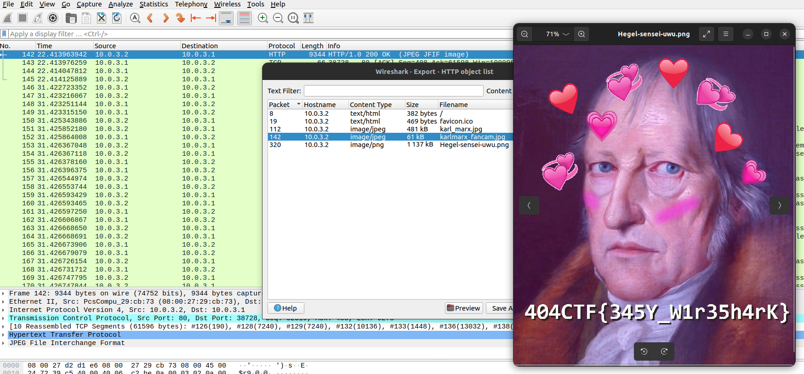
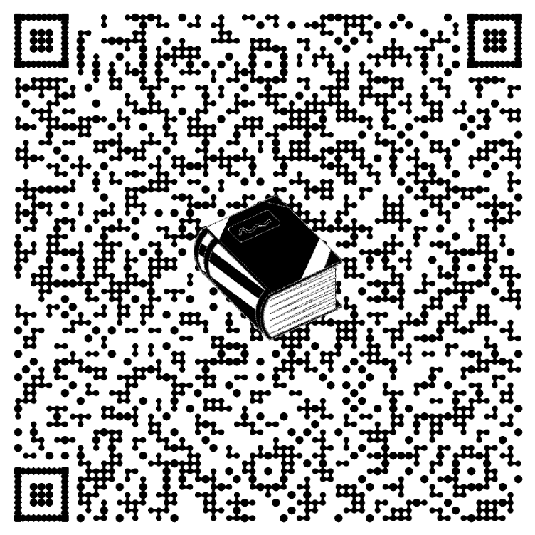
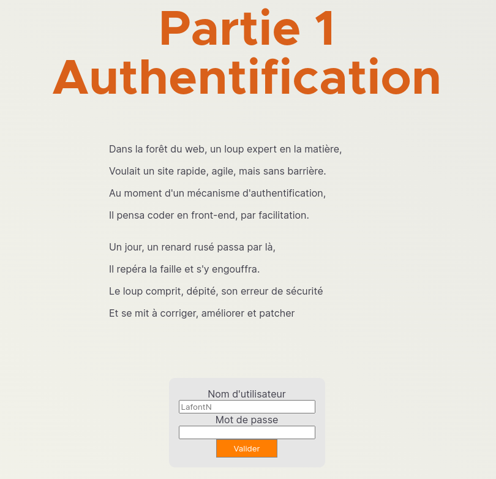
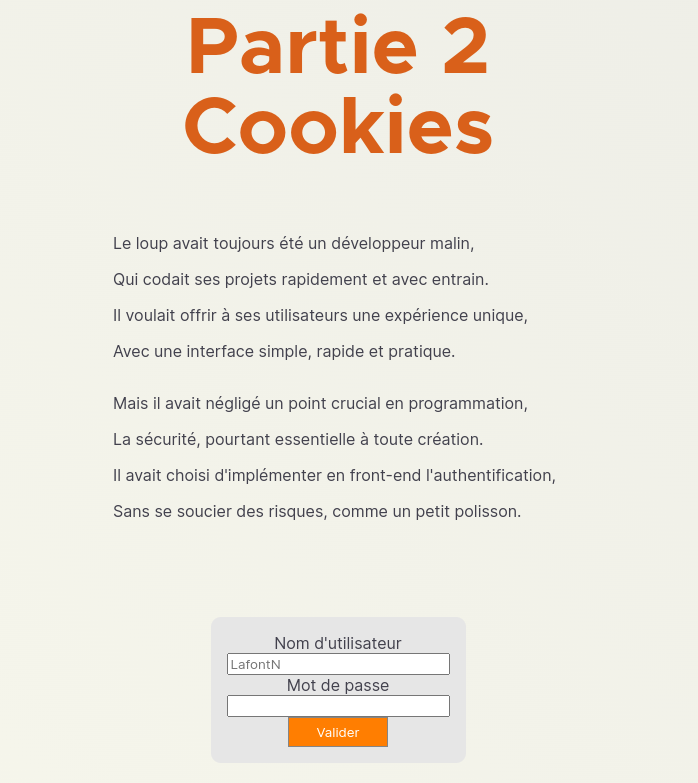
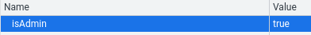
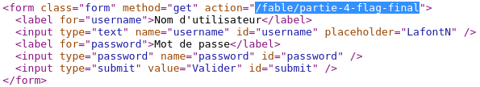
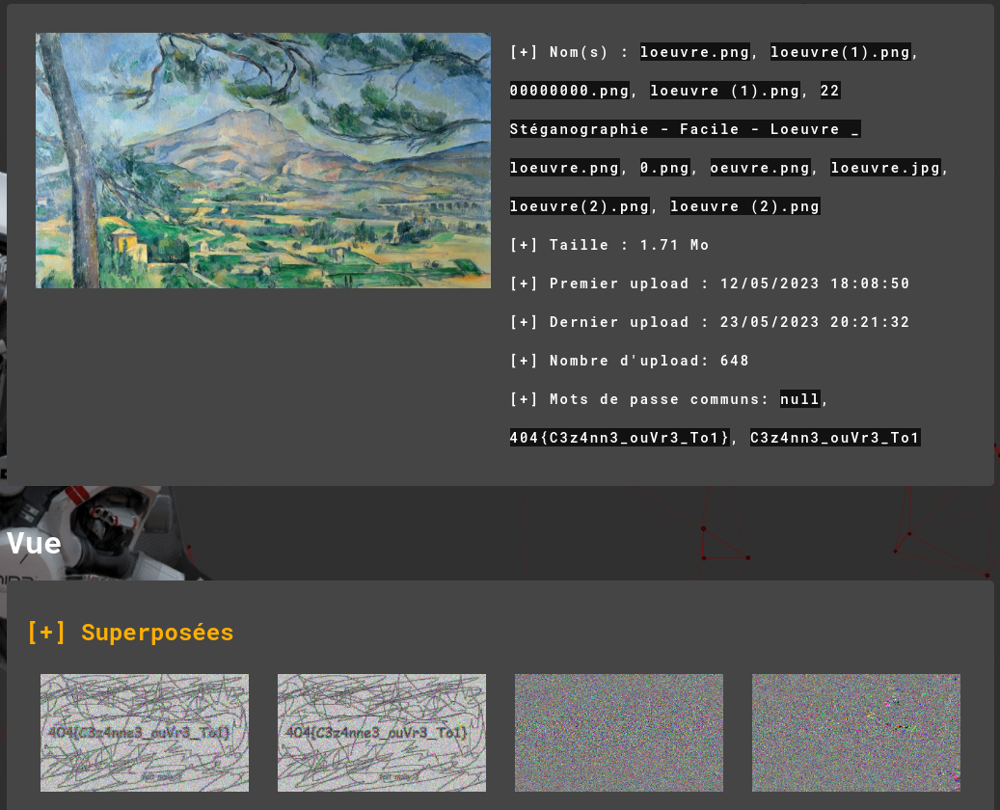

---
categories:
- CTF
- 2023
- 404CTF
status: done
tags: CTF, 404CTF
---

# 404CTF

**Website :** [404CTF](https://ctf.404ctf.fr/)


**Description :** Coorganisé par la _Direction Générale de la Sécurité Extérieure_ et _Télécom SudParis_, le 404CTF est la plus grande compétition de cybersécurité de France. Après le succès de l'_édition 2022_ qui célébrait le double anniversaire du BCRA et de la DGSE, cette deuxième édition mettra à l'honneur les grandes figures de la littérature française.

## **Table of Contents**

1. Miscellaneous
	- [Bienvenue!](#Bienvenue!)
	- [Exemple_de_connexion_distante](#Exemple_de_connexion_distante)
	- [Discord](#Discord)

2. Pwn
	- [Je_veux_la_lune!](#Je_veux_la_lune!)

3. Forensics
	- [Peche_au_livre](#Peche_au_livre)
	- [Le_Mystère_du_roman_d'amour](#Le_Mystère_du_roman_d'amour)
	- [Les_Mysteres](#Les_Mysteres)

1. OSINT
	- [Le_Tour_de_France](#Le_Tour_de_France)

2. Programmation
	- [L'Inondation](#L'Inondation)

3. Web
	- [Le_Loup_et_le_renard](#Le_Loup_et_le_renard)

4. RF
	- [Navi](#Navi)

5. Steganography
	- [L'Oeuvre](#L'Oeuvre)

## **Bienvenue!**


**Challenge Description :** Si vous souhaitez accéder au reste du 404 CTF, nous vous invitons à lire la page des règles. Le premier flag s'y trouve afin que vous puissiez valider la présente épreuve et débloquer les autres énoncés.

### Approach

I just have to read the rules and find the flag.

**Flag :** `404CTF{c'est parti}`

## **Exemple_de_connexion_distante**


**Challenge Description :** Too long

### Approach

The descriptions of this challenge explain me how I can use `netcat` tool. I have check the result of `nc challenges.404ctf.fr 30076` command:

```shell
nc challenges.404ctf.fr 30076 
404CTF{I_<3_nc}
```

**Flag :** `404CTF{I_<3_nc}`

## **Discord**


**Challenge Description :** Le flag est directement écrit quelque part dans le serveur, pas besoin de faire de manipulations particulières. Et surtout, cherchez bien !

### Approach

Ok, the flag is in the discord. Let's check it:


**Flag :** `404CTF{Un_bon_pour_un_cafe_gratuit}`

## **Je_veux_la_lune!**


**Challenge Description :** Too long (I have to read a file across program)

### Approach

In first I have to see how the program work and analyse the source coded of the program given.

After few try, I found the payload `caligula informations.txt && ls && cat lune.txt && echo ok` and`caligula informations.txt; cat lune.txt`.

**Flag :** `404CTF{70n_C0EuR_v4_7e_1Ach3R_C41uS}`

## **Peche_au_livre**


**Challenge Description :** Too long (I have to find thing in `.pcapng`)

### Approach

I see images in `HTTP` frame. I decide to check in Download object for see images and I found the flag:


**Flag :** `404CTF{345Y_W1r35h4rK}`

## **Le_Mystère_du_roman_d'amour**


**Challenge Description :** Too long

### Approach

When I have a file whose origin I don't know, I use the command `file` for more informations:
```shell
file fichier-etrange.swp                  
fichier-etrange.swp: Vim swap file, version 7.4, pid 168, user jaqueline, host aime_ecrire, file ~jaqueline/Documents/Livres/404 Histoires d'Amour pour les bibliophiles au coeur d'artichaut/brouillon.txt
```

The `file` allow me to find many informations and the origin of the file is **vim swap file**.

After research on vim, I can try this command below for find the original file:
```shell
vim -r fichier-etrange.swp
```

In fact, it's `.png` file, so I can register it with `:w file.png` in vim.

The image is like this:


In [Aperisolv](https://www.aperisolve.com/), I find this:


And when I scan it, I have the flag.

**Flag :** `404CTF{168-/home/jaqueline/Documents/Livres/404 Histoires d'Amour pour les bibliophiles au coeur d'artichaut/brouillon.txt-jaqueline-aime_ecrire-3n_V01L4_Un_Dr0l3_D3_R0m4N}`

## **Le_Mystère_du_roman_d'amour**


**Challenge Description :** Votre mission consiste à exploiter le fichier fourni pour y retrouver les traces du maître chanteur.

### Approach

I have a zip file with many file and directory in. I check all off them and once off interesting me. It's a bash_history. In I found a `curl` command  


**Flag :** 

## **Le_Tour_de_France**


**Challenge Description :** Trouvez la position exacte des panneaux.

### Approach

I have to find **GPS coordinates** of this road Signs:


After several searches, I found signs and locale the GPS informations.

**Flag :** `404CTF{47.01,04.86}`

## **L'Inondation**


**Challenge Description :** Too long

### Approach

I have a `netcat` connection and I have a lot of questions that I need to answer very quickly. For this challenge, I have to write program for resolve it. I choose `python` for is simplicity:

```python
import socket

# Constants
HOST = 'challenges.404ctf.fr'
PORT = 31420

# Variable
buffer = b""

# Open file descriptor for socket connection
with socket.socket(socket.AF_INET, socket.SOCK_STREAM) as s :
    s.connect((HOST, PORT))

	# While loop
    while True:
        buffer += s.recv(2048)
        print(buffer.decode(errors="ignore"))

        # 'if' condition for detect the question and answer it
        if ">" in buffer.decode(errors="ignore"):
            print(buffer.decode(errors="ignore"))
            counter = buffer.decode().count("~")
            s.send(f"{counter}\n".encode())
            buffer = b""

# Close socket connection
s.close()
```

**Flag :** `404CTF{4h,_l3s_P0uvo1rs_d3_l'iNforM4tiqu3!}`

## **Le_Loup_et_le_renard**


**Challenge Description :** Ouvrez l'œil et trouvez la fin de cette fable.

### Approach

Let's go on the link and see what is it:


Ok, I decide to check the source code of the page and I see the credentials for the first part:


Now, I'm on the second step:


I see this is talking about cookies so I take a look with inspect element and change the value "false" in "true":


I have step up and see a page with *Redirect* title. I decide to check the source code and see the redirection of the form:


After go on this page, I see the flag !


**Flag :** `404CTF{NO_fr0n1_3nD_auTh3nt1ficAti0n}`

## **Navi**


**Challenge Description :** Too long (I have to analyse .raw file)

### Approach

After listening, I heard a second voice in the background. Several plays allow me to make adjustments to the effects and to be able to hear the flag in hexadecimal:
`3430344354467b317472305f3455785f52346431302d6652337155334e6333357d`

Now I just have to go to [CyberChef](https://gchq.github.io/CyberChef/) and decrypt the string for read the flag.

**Flag :** `404CTF{1tr0_4Ux_R4d10-fR3qU3Nc35}`

## **L'Oeuvre**


**Challenge Description :** Too long (I have one picture)

### Approach

Like every photo I have in steganography, I pass it on the [AperiSolv](https://www.aperisolve.com/) site and bingo, I have directly a result:


**Flag :** `404{C3z4nne3_ouVr3_To1}`