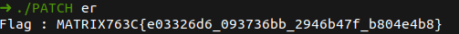
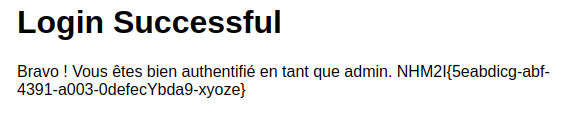
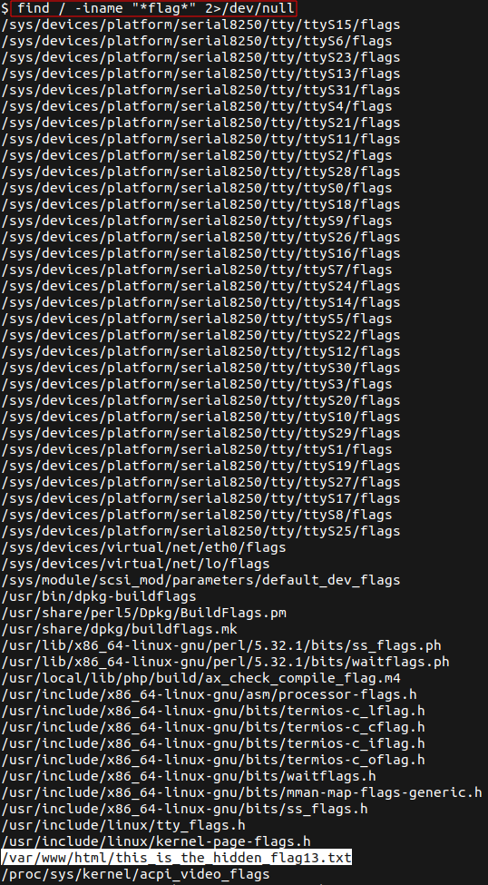

---
categories:
- CTF
- 2023
- CciCTF
status: done
tags: CTF 
---
# CciCTF

**Website :** [CciCTF](https://campus.vaucluse.cci.fr/)

**Description :** Nos apprentis de deuxième année en cyber-sécurité et leur enseignants sont ravis de vous inviter la nuit du 31 mars au 1er avril sur le Campus de la CCI de Vaucluse pour une capture de drapeau numérique !

## **Table of Contents**

1. Reverse
	- [Hello_World_!](#Hello_World_!)
	- [Reverse](#Reverse)
	- [Some_Base](#Some_Base)
	- [Security_Key](#Security_Key)
	- [HackMatrix](#HackMatrix)
	- [Mot_De_Passe_Perdu](#Mot_De_Passe_Perdu)
	- [Reverser_Don't_Like_Licencer](#Reverser_Don't_Like_Licencer)
	 - [N0pe](#N0pe)
	- [POV](#POV)

2. Web
	- [Get_Password](#Get_Password)
	- [BOT](#BOT)
	- [Jeu_Gratuit_!](#Jeu_Gratuit_!)
	- [Site_Interdit_Aux_Mineurs](#Site_Interdit_Aux_Mineurs)
	- [File_Upload](#File_Upload)

1. Forensics
	- [Pcap2](#Pcap2)
	- [Investiga_1](#Investiga_1)
	- [Gmail_Proof](#Gmail_Proof)

## Hello_World_!

**Challenge Description :** Hum... Voici un fichier binaire. Peut-être qu'en le décompilant vous pouvez en tirer quelque chose ?

### Approach

I know `strings` command, let's check if I can see something:

Yes ! I have the flag !

**Flag :** `NHM2I{simpl3_introduction_to_r3v3rs3}`

## Reverse

**Challenge Description :** Hum... Voici un fichier binaire. Peut-être qu'en le décompilant vous pouvez en tirer quelque chose ?

### Approach

`strings` command work well, so let's try it:

I have a part of flag, but i also have the password of the challenge, I launch the binary and obtain the flag.

**Flag :** `flag{r3ver5er_0f_th3_ye4rs_Gg}`

## Some_Base

**Challenge Description :** Voici un nouveau fichier. A vous de jouer :p

A `strings` command don't help me for this challenge. I can launch my favorite `BinaryNinja` and analyse the code. 

I can see an `if` condition who goes for `print` the flag in the terminal but I never go in. With `BinaryNinja` I can change conditions with a `PATCH` :

Run binary and now I always go into he condition for `print` my flag :)

**Flag :** `NHM2I{this_is_a_gr3at_r3v3rs3!}`

## Security_Key

**Challenge Description :** Too long  :(

This is the same methodology for this challenge as the previous one. Open `BinaryNinja` analyse logic of the code and PATCH it.

**Flag :** `NHM2i{AAAA-Z10N-42-OK-CodeByrZmFeatTrinity}`

## HackMatrix

**Challenge Description :** Also too long :(

After launch the binary and multiple tests, I found the same result and no flag. 

So let's open `BinaryNinja` and analyse the code !

I can see the `if` condition who give me the 0 flag. So I can invert it for always go in `else`: 

And Magic operates !

**Flag :** `NHM2I{e03326d6_093736bb_2946b47f_b804e4b8}`

## Mot_De_Passe_Perdu

**Challenge Description :** Retrouver le mot de passe qui permet d’accéder à l'application.

I the same logic, open `BinaryNinja` and analyse the code.

In this challenge I do a PATCH but I don't have see the password in plain text over my eyes LoL

**Flag :** `NHM2I{ac78c15c-27e7-43af-b8b1-29df4e5831d8}`

## N0pe

**Challenge Description :** J'ai acheté un nouveau jeu mais j'ai perdu ma licence. Pouvez-vous m'aider ??

I love `BinaryNinja` and this challenge is proof for why. I have launch it and analyse code. I see `print_flag()` function. So, I just say to `BinaryNinja` to never go in `if` condition for always print flag !

After PATCH:

I can put any characters after modifications:

**Flag :** `NHM2I{Byp4s5_L1cenc3_1s_34sy}`

## N0pe

**Challenge Description :** Too lonnnng :(

An other challenge finished with `BinaryNinja` and the same methodology:

I can put any characters, the flags is printed.

**Flag :** `NHM2I{jkMOPawBRl-SjwMGEu1EJ-4Z4TNCtzxd}`

## POV

**Challenge Description :** Un élève à **encore** fait n'importe quoi avec son code, je suis M. Naviliat (aka the GOAT), je suis là pour l'aider. Voilà ce qu'il m'a rendu...

This challenge is an other time, break with `BinaryNinja`.

**Flag :** `NHM2I{b035a154-defe-4250-8c6a-3fe3562d9c1c}`

## Get_Password

**Challenge Description :** Tooooo long :(

After a short visit of the web site, in source code, I see a bad variable `password`. This variable contain the password in cipher text:

`dcode` works very well:

I just to login me and have the flag:

**Flag :** `NHM2I{...}`

## BOT

**Challenge Description :** Too long :(

I launch a dirb for this challenge and fall on `sitemap.xml` page. The flag as here.

**Flag :** `NHM2I{ENUMERATION_IS_THE_KEY}`

## Jeu_Gratuit_!

**Challenge Description :** Un ami m'a recommandé ce jeu, mais je n'arrive pas à me connecter. Sais-tu comment faire ?

After checking all basics point, I see a text box and button disabled. I have to enabled it:

**Flag :** `NHM2I{!I3stNullC3Dev}`

## Site_Interdit_Aux_Mineurs

**Challenge Description :** Nous sommes tombés sur ce site par hasard et nous ne pouvons pas y accéder, car il détecte que nous sommes pas majeurs.

I can test to change `span` code where it's mentioned he age for have the flag:

**Flag :** `NHM2I{...}`

## File_Upload

**Challenge Description :** I don't have :(

This web site contain a file upload section who accept just `.php` files. Let's try basic file upload with php reverse shell:

I setup my reverse shell:

Ok, now I can launch `nc` listener and click on the click for have shell:

I just have to check where is flag for `cat` it:

**Flag :** `NHM2I{GG_Fileuploaded!!}`

## Pcap2

**Challenge Description :** Too long :(

this challenge is just a classic challenge with wireshark. Follow TCP stream:

**Flag :** `NHM2I{hjdhdh-JDJ8786D-jkfh0-87897-RTbd7}`

## Investiga_1

**Challenge Description :** Retrouver le flag dans la trace `PCAP`.

This challenge more difficult to see but ICMP does not contain "W3lld0neP1ng" in basic trame.

**Flag :** `NHM2I{W3lld0neP1ng}`

## Gmail_Proof

**Challenge Description :** Too Looong :(

An simple `Ctrl+F` on the file permit me to see the flag:

**Flag :** `NHM2I{Qu3Del4PubSur73mail!}`