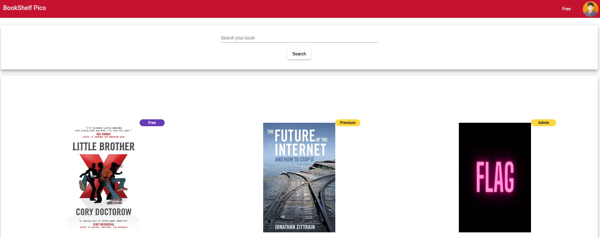
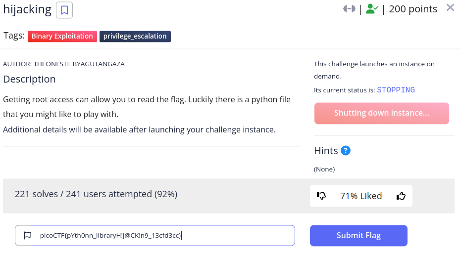

---
categories:
- CTF
- 2023
- PicoCTF
status: done
tags: CTF, 2023, PicoCTF
---
# PicoCTF

**Website :** [PicoCTF](https://picoctf.org/)

**Description :** PicoCTF gamifies learning hacking with capture-the-flag puzzles created by trusted computer security and privacy experts at [Carnegie Mellon University](https://cmu.edu/).

## **Table of Contents**

1. GeneralSkills
	- [Rules](#Rules)
	- [Repetitions](#Repetitions)
	- [MoneyWare](#MoneyWare)
	- [Permissions](#Permissions)
	- [Chrono](#Chrono)
	- [Useless](#Useless)

2. Cryptography
	- [Rotation](#Rotation)
	- [ReadMyCert](#ReadMyCert)
	- [HideToSee](#HideToSee)

3. Forensics
	- [HideMe](#HideMe) 
	- [PcapPoisoning](#PcapPoisoning)
	- [WhoIsIt](#WhoIsIt)

4. Web
	- [FindMe](#FindMe)
	- [JavaCodeAnalys!?!](#JavaCodeAnalysis!?!)
	- [SOAP](#SOAP)

6. Reverse
	- [SafeOpener2](#SafeOpener2)
	- [Reverse](#Reverse)
	- [Timer](#Timer)

8. Pwn
	- [TwoSum](#TwoSum)
	- [Hijacking](#Hijacking)
	- [TicTac](#TicTac)

## **Rules**

**Challenge Description :** Read the rules of the competition and get a little bonus !

### Approach

Let's check rules link and get the flag.

**Flag :** `picoCTF{h34rd_und3r5700d_4ck_cba1c711}`

## **Repetitions**

**Challenge Description :** Can you make sense of this file ?

### Approach

As you can see in the challenge tags it's `base64` in the `.txt` file I just downloaded and it repeats. `Cyberchef` is the perfect tool for this challenge.

After several decryption in `base64` I find the flag.

**Flag :** `picoCTF{base64_n3st3d_dic0d!n8_d0wnl04d3d_fffe6738}`

## **MoneyWare**

**Challenge Description :** Your friend just got hacked and has been asked to pay some bitcoins to `1Mz7153HMuxXTuR2R1t78mGSdzaAtNbBWX`. 
He doesn’t seem to understand what is going on and asks you for advice. Can you identify what malware he’s being a victim of ?

### Approach

After one research on google with : `1Mz7153HMuxXTuR2R1t78mGSdzaAtNbBWX`

The wallet was used by Petya ransomware.

**Flag :** `picoCTF{Petya}`

## **Permissions**

**Challenge Description :** Can you read files in the root file ?

### Approach

As you can see in the challenge tags is about vim and permissions. I know this type of challenge. Let's check on [GTFOBins](https://gtfobins.github.io/) if I find a good payload.

Vim let me spawn a shell with root permissions and now it's easy to check /root flag.

**Flag :** `picoCTF{uS1ng_v1m_3dit0r_2fb487cc}`

## **Chrono**

**Challenge Description :** How to automate tasks to run at intervals on linux servers ?

### Approach

The description of the challenge allows me to see that this challenge talks about crontabs. Let's list them.

**Flag :** `picoCTF{Sch3DUL7NG_T45K3_L1NUX_05e9ab5e}`

## **Useless**

**Challenge Description :** There's an interesting script in the user's home directory

### Approach

An other time, a good reading of the description helps for the challenge. 
Let's try `man useless`.

**Flag :** `picoCTF{us3l3ss_ch4ll3ng3_3xpl0it3d_4675}`

## **Rotation**

**Challenge Description :** You will find the flag after decrypting this file.

### Approach

As the title talks about rotation, I immediately think of rotational encryption and I go to [dcode](https://www.dcode.fr/) for brute-force and see the result.

**Flag :** `picoCTF{r0tation_d3crypt3d_59b71977}`

## **ReadMyCert**

**Challenge Description :** How about we take you on an adventure on exploring certificate signing requests.

### Approach

I see that I just downloaded a `.csr` file and so I decide to click on it. This open a window, I observe and see the flag directly.

**Flag :** `picoCTF{read_mycert_e075addc}`

## **HideToSee**

**Challenge Description :** How about some hide and seek heh ?

### Approach

After many try on [Aperi'Solve](https://www.aperisolve.com/),  and others ... just https://futureboy.us/stegano/decinput.html allowed me to find the cipher hidden in the image.

`krxlXGU{zgyzhs_xizxp_v7uzz0v5}`

After tests on dcode and cyberchef I did not find any data in clear. Infact I had forgotten that it was around the atbash cipher...

Finally, by noting the alphabet on a sheet to find the character string that is found at each challenge (picoCTF). I realized that the letters were substituted with the same alphabet but reversed, I could then the rest of the characters.

**A, B, C, D, E, F, G, H, I, J, K, L, M, N, O, P, Q, R, S, T, U, V, W, X, Y, Z**
**Z, Y, X, W, V, U, T, S, R, Q, P, O, N, M, L, K, J, I, H, G, F, E, D, C, B, A**

**Flag :** `picoCTF{atbash_crack_e7faa0e5}`

## **HideMe**

**Challenge Description :** The SOC analyst saw one image been sent back and forth between two people. They decided to investigate and found out that there was more than what meets the eye.

### Approach

Every time, I put the image in first in Aperi'Solve and I see an intriguing thing like a ZIP archive in `.png`.

Let's try to unzip it !

I can see a folder and an image that is unzipped. I just have to open the picture and see the flag.

**Flag :** `picoCTF{Hiddinng_An_imag3_within_@n_ima9e_5fbf3ff9}`

## **PcapPoisoning**

**Challenge Description :** How about some hide and seek heh ?

### Approach

After checking the Statistics of the capture on Wireshark. The thing that I do always for understand where I put my foot. I see FTP conversation and I put my investigation on it.

When I try to follow tcp stream I can see a clue (end of the flag).

By instinct, I double click on the 2nd trame and see the flag.

**Flag :** `picoCTF{P64P_4N4L7S1S_SU55355FUL_14f62f23}`

## **WhoIsIt**

**Challenge Description :** Someone just sent you an email claiming to be Google's co-founder Larry Page but you suspect a scam.
Can you help us identify whose mail server the email actually originated from ?

### Approach

In first, I open the file, inspect it and see IP address, let's see if whois can give me name information that I need for flag.

`whois` on websites gives not all information, try on shell.

**Flag :** `picoCTF{WilhelmZwalina}`

## **FindMe**

**Challenge Description :** Help us test the form by submiting the username as `test` and password as `test!`

### Approach

This challenge is about redirections so, I open burpsuite and intercept all traffic for analyze step by step.

Results are here but encoded in base64

**Flag :** `picoCTF{proxies_all_the_way_81d4d831}`

## **JavaCodeAnalysis!?!**

**Challenge Description :** BookShelf Pico, my premium online book-reading service.I believe that my website is super secure. I challenge you to prove me wrong by reading the 'Flag' book !

### Approach

I'm coming on website who have 3 books and 1 book requiring Admin access (for reading the flag).

Inspection tool according to me to see an auth-token with `JWT` .

JWT was encoded with a secret, so I had to crack it with `hashcat`.

After that, I modify it on https://jwt.io/ and I put it in website.

After refreshing, I have my new authorizations (Admin), I can enter in the Admin dashboard and modify `user` permissions in `Admin`.

After logout/logon, user have good permissions for read the flag in the book.

**Flag :** `picoCTF{w34k_jwt_n0t_g00d_42f5774a}`

## **SOAP**

**Challenge Description :** The web project was rushed and no security assessment was done. Can you read the /etc/passwd file ?

### Approach

After much research to find a way to attack, I returned to instructions and I see `XXE` in tags. I never do this so I go on google to find things and I fall on a really good page (https://portswigger.net/web-security/xxe) who according to me to done this challenge.

When I click on button, It send `XML` to server.

Modify this `XML` for `XXE`.

Result not on pictures but I can see `/etc/passwd` dans flag was in.

**Flag :** `picoCTF{XML_3xtern@l_3nt1t1ty_e79a75d4}`

### Reflection

This challenge was pretty cool because it's thing that I nerver see.

## **SafeOpener2**

**Challenge Description :** What can you do with this file?I forgot the key to my safe but this file is supposed to help me with retrieving the lost key. Can you help me unlock my safe ?

### Approach
  
Like all the java code I see, I try to decompile it.

The flag was here.

**Flag :** `picoCTF{SAf3_Op3n3rr_y0u_solv3d_it_6d84122a}`

## **Reverse**

**Challenge Description :** Try reversing this file ? Can ya ?

### Approach
  
In first when I have file to reverse it. I do the command `strings`

The flag is here.

**Flag :** `picoCTF{3lf_r3v3r5ing_succe55ful_70eeb}`

## **Timer**

**Challenge Description :** You will find the flag after analysing this apk.

### Approach
  
I was never working on apk, I found decompiler (MobSF)

The flag is in `Android Version Name`.

**Flag :** `picoCTF{t1m3r_r3v3rs3d_succ355fuly_17496}`

## **TwoSum**

**Challenge Description :** Can you solve this ?

### Approach
  
After analysis, the given code contains a buffer overflow vulnerability in the `fgets` function call.

**Flag :** `picoCTF{Tw0_Sum_Integer_Bu773R_0v3rfl0w_f6ed8057}`

## **Hijacking**

**Challenge Description :** Getting root access can allow you to read the flag. Luckily there is a python file that you might like to play with.

### Approach

The challenge talks about playing with the python script but I found a permissions flaw on the vi tool so I exploited it

**Flag :** `picoCTF{pYth0nn_libraryH!j@CK!n9_13cfd3cc}`

## **TicTac**

**Challenge Description :** Someone created a program to read text files; we think the program reads files with root privileges but apparently it only accepts to read files that are owned by the user running it.

### Approach

The tags talk about `toctou` so I went to google and it's a flaw in the linux system. I followed the instructions and the payload worked.

https://samsclass.info/127/proj/E10.htm

**Flag :** `picoCTF{ToctoU_is_3a5y_04909d70a}`