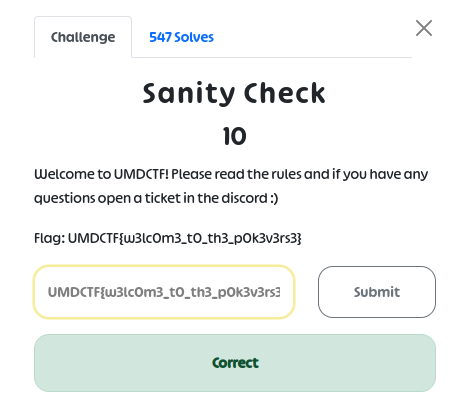
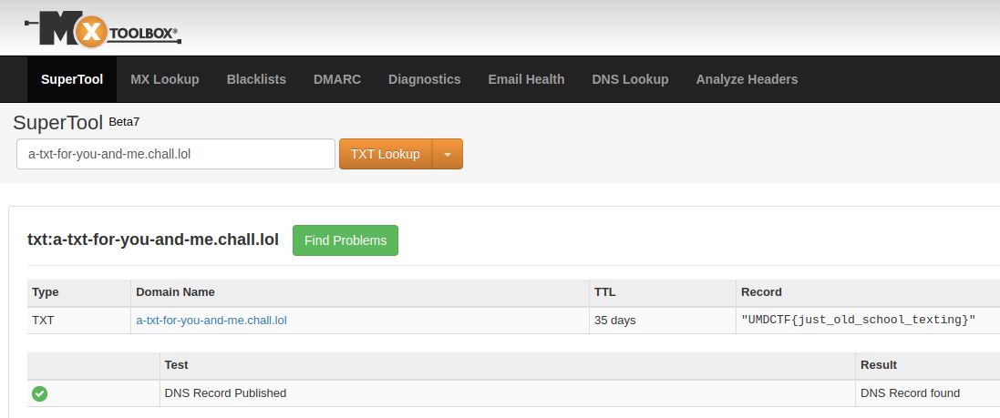
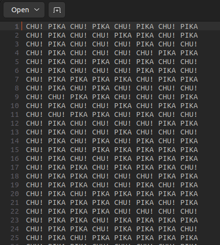
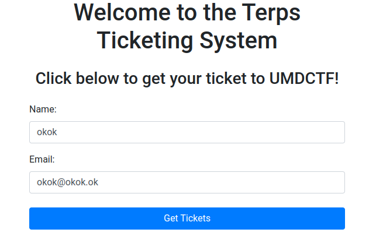
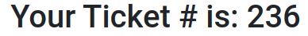
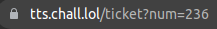
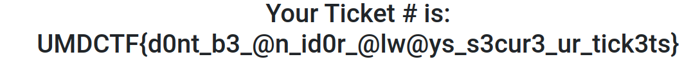

---
categories:
- CTF
- 2023
status: done
tags: CTF
---

# UmdCTF

**Website :** [UmdCTF](https://umdctf.io/)


**Description :** UMDCTF 2023 is the seventh annual competition hosted by the cybersecurity club at the University of Maryland, College Park!

## **Table of Contents**

1. Miscellaneous
	- [Sanity_Check](#Sanity_Check)
	- [A_TXT_For_You_and_Me](#A_TXT_For_You_and_Me)

2. Cryptography
	- [pokecomms](#pokecomms)

3. Web
	- [Terps_Ticketing_System](#Terps_Ticketing_System)


## **Sanity_Check**


**Challenge Description :** Welcome to UMDCTF! Please read the rules and if you have any questions open a ticket in the discord :)

### Approach

The flag is in plaintext, in the pop-up of the challenge.



**Flag :** `UMDCTF{d0nt_b3_@n_id0r_@lw@ys_s3cur3_ur_tick3ts}`

## **A_TXT_For_You_and_Me**


**Challenge Description :** We may not have A, AAAA, or even an MX, but boy do we have a TXT for you! Just grab it from `a-txt-for-you-and-me.chall.lol`

### Approach

I know that records DNS  can be in `TXT`, So I decide to check around this. 
I can check all `TXT` of one domain by command-line:
```shell
nslookup -q=txt a-txt-for-you-and-me.chall.lol
Server:		127.0.0.53
Address:	127.0.0.53#53

Non-authoritative answer:
a-txt-for-you-and-me.chall.lol	text = "UMDCTF{just_old_school_texting}"
```

And the flag is here ! Or I can browse web site for graphic DNS lookup:


**Flag :** `UMDCTF{just_old_school_texting}`

## **pokecomms**


**Challenge Description :** Comms are vital to winning matches. Pikachu looks a little angry. You should figure out what he's saying before he bytes you.

### Approach

After I have open the file, I fall on this text, It's like à Pokemon language. Maybe this language exist!



https://www.dcode.fr/langage-pikalang have a page for decrypt pikalang.

**Flag :** 
```
UMDCTF{P1K4CHU_Once_upon_a_time,_there_was_a_young_boy_named_Ash_who_dreamed_of_becoming_the_world's_greatest_Pokemon_trainer._He_set_out_on_a_journey_with_his_trusty_Pokemon_partner,_Pikachu,_a_cute_and_powerful_electric-type_Pokemon._As_Ash_and_Pikachu_traveled_through_the_regions,_they_encountered_many_challenges_and_made_many_friends._But_they_also_faced_their_fair_share_of_enemies,_including_the_notorious_Team_Rocket,_who_were_always_trying_to_steal_Pikachu._Despite_the_odds_stacked_against_them,_Ash_and_Pikachu_never_gave_up._They_trained_hard_and_battled_even_harder,_always_looking_for_ways_to_improve_their_skills_and_strengthen_their_bond._And_along_the_way,_they_learned_valuable_lessons_about_friendship,_determination,_and_the_power_of_believing_in_oneself._Eventually,_Ash_and_Pikachu's_hard_work_paid_off._They_defeated_powerful_opponents,_earned_badges_from_Gym_Leaders,_and_even_competed_in_the_prestigious_Pokemon_League_tournaments._But_no_matter_how_many_victories_they_achieved,_Ash_and_Pikachu_never_forgot_where_they_came_from_or_the_importance_of_their_friendship._In_the_end,_Ash_and_Pikachu_became_a_legendary_team,_admired_by_Pokemon_trainers_around_the_world._And_although_their_journey_may_have_had_its_ups_and_downs,_they_always_knew_that_as_long_as_they_had_each_other,_they_could_overcome_any_obstacle_that_stood_in_their_way}
```

## **Terps_Ticketing_System**


**Challenge Description :** Welcome to the Terps Ticketing System! We're currently giving out tickets for the UMDCTF going on right now. Just enter some information and grab your ticket!

### Approach

I'm redirected on a web site and login page. 


After being logged in, I see my ticket number:


But I also see my ticket number in the URL of the web site:


I can try to change this number and see if I am redirected to another ticket number.

This is the case and after many try, I found the ticket number 0 which is the flag!


**Flag :** `UMDCTF{d0nt_b3_@n_id0r_@lw@ys_s3cur3_ur_tick3ts}`